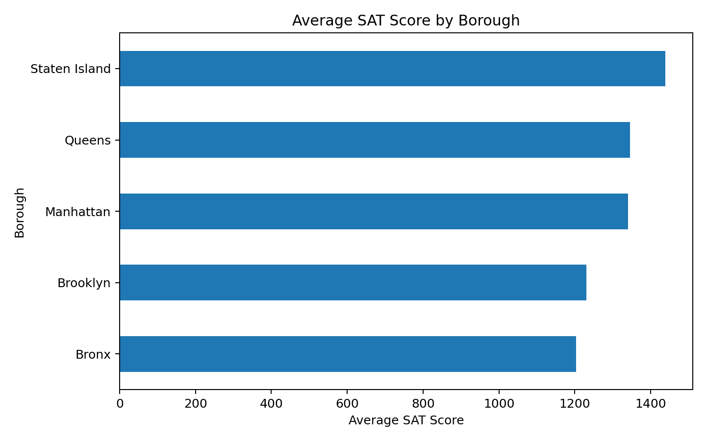
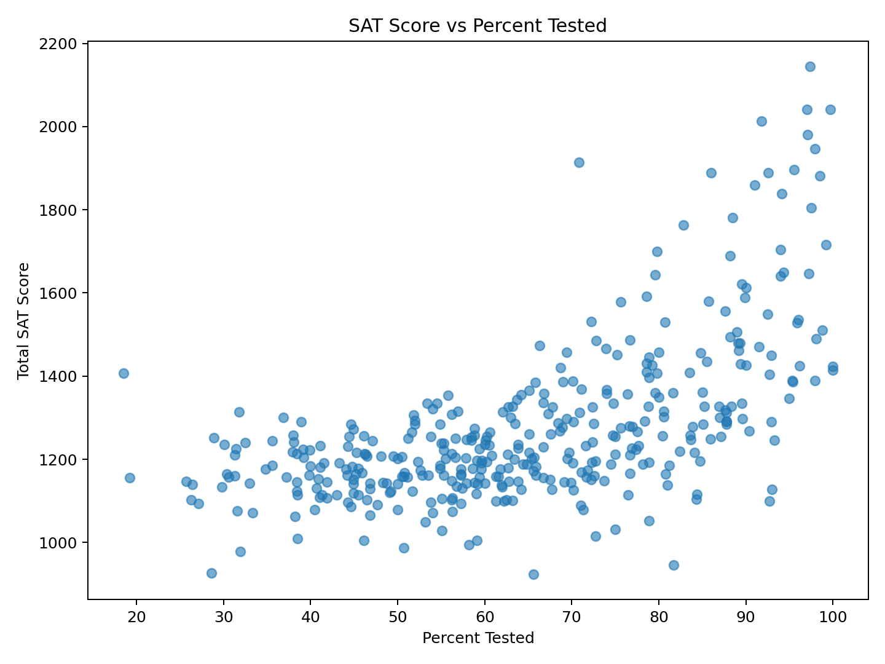
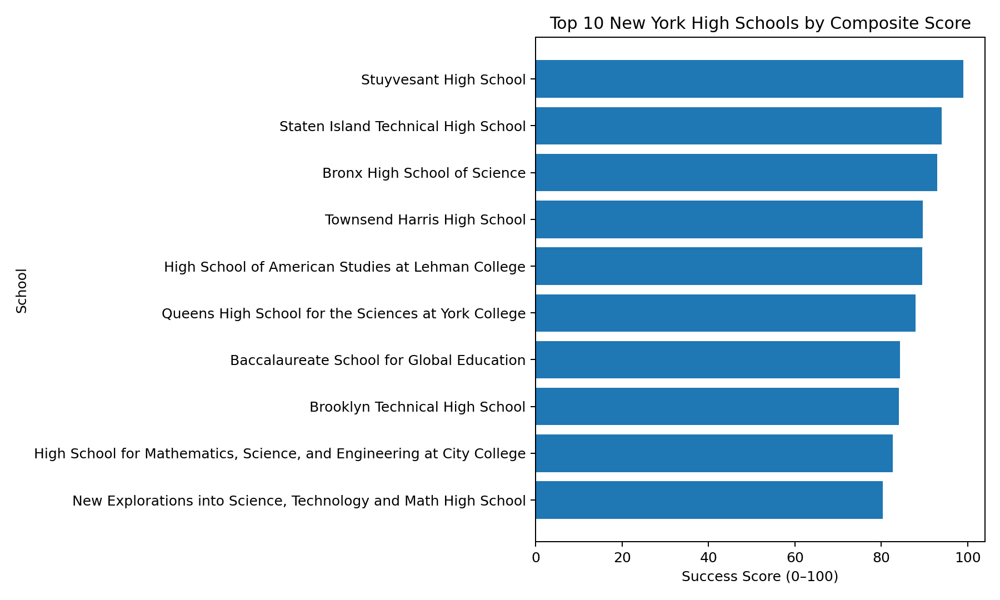

# nyc_scholl_success_analysis
A data analysis project that ranks New York City high schools using SAT scores, test participation, normalization, and sensitivity analysis.


# NYC School Success Analysis

A reproducible exploratory data analysis project that identifies high-performing New York City schools using SAT performance and SAT participation. The project was developed in Google Colab and organized here as a GitHub-ready repository.

> **Definition used in this project:** “high-performing” means a school has a high composite score built from normalized total SAT score (70%) and SAT participation rate (30%). This is a project-specific operational definition, not a universal measure of school quality.

## Highlights

- **435** schools in the raw dataset
- **375** schools with complete SAT Math, Reading, and Writing data
- Mean Total SAT Score: **1275.91**
- SAT score vs participation correlation: **0.606**
- Sensitivity analysis across 50/50, 70/30, 80/20, and 90/10 weightings
- **9 schools** remained in the top 10 across all tested weighting schemes

## Top 10 schools

|    | School Name                                                           | Borough       |   Total SAT Score |   Percent Tested Numeric |   Success Score 100 |
|---:|:----------------------------------------------------------------------|:--------------|------------------:|-------------------------:|--------------------:|
|  1 | Stuyvesant High School                                                | Manhattan     |              2144 |                     97.4 |               99.04 |
|  2 | Staten Island Technical High School                                   | Staten Island |              2041 |                     99.7 |               93.98 |
|  3 | Bronx High School of Science                                          | Bronx         |              2041 |                     97   |               92.99 |
|  4 | Townsend Harris High School                                           | Queens        |              1981 |                     97.1 |               89.58 |
|  5 | High School of American Studies at Lehman College                     | Bronx         |              2013 |                     91.8 |               89.47 |
|  6 | Queens High School for the Sciences at York College                   | Queens        |              1947 |                     97.9 |               87.92 |
|  7 | Baccalaureate School for Global Education                             | Queens        |              1881 |                     98.5 |               84.36 |
|  8 | Brooklyn Technical High School                                        | Brooklyn      |              1896 |                     95.5 |               84.11 |
|  9 | High School for Mathematics, Science, and Engineering at City College | Manhattan     |              1889 |                     92.6 |               82.64 |
| 10 | New Explorations into Science, Technology and Math High School        | Manhattan     |              1859 |                     91   |               80.33 |

## Methodology

1. Load and inspect the dataset.
2. Keep schools with complete SAT Math, Reading, and Writing scores.
3. Create **Total SAT Score** as Math + Reading + Writing.
4. Convert percentage strings to numeric values.
5. Explore borough-level statistics and SAT participation.
6. Min-max normalize SAT score and participation.
7. Compute the composite score:

   `Success Score = 0.70 × SAT Normalized + 0.30 × Tested Normalized`

8. Rank schools by the composite score.
9. Run sensitivity analysis using alternative weightings.
10. Export the final tables and figures.

## Repository structure

```text
nyc-school-success-analysis/
├── README.md
├── LICENSE
├── requirements.txt
├── .gitignore
├── data/
│   ├── scores.csv
│   └── README.md
├── notebooks/
│   └── nyc_school_success_analysis.ipynb
├── src/
│   └── analysis.py
├── outputs/
│   ├── top_10_nyc_schools.csv
│   ├── borough_summary.csv
│   ├── correlation_matrix.csv
│   ├── sensitivity_spearman.csv
│   └── figures/
│       ├── borough_average_sat.png
│       ├── sat_vs_percent_tested.png
│       ├── top10_success_score.png
│       └── top10_geography.png
└── reports/
    ├── DATA_DICTIONARY.md
    └── PROJECT_SUMMARY.md
```

## Visuals

### Borough average SAT



### SAT score vs participation



### Final top 10



## Run locally

```bash
git clone <your-repository-url>
cd nyc-school-success-analysis
python -m venv .venv
# Windows: .venv\Scripts\activate
# macOS/Linux: source .venv/bin/activate
pip install -r requirements.txt
python src/analysis.py
```

For an interactive walkthrough, open:

```text
notebooks/nyc_school_success_analysis.ipynb
```

## Main findings

- Stuyvesant High School received the highest composite score in the 70/30 specification.
- The top-ranking group was robust to reasonable changes in SAT/participation weighting.
- SAT participation and total SAT score showed a positive correlation in this dataset.
- Borough averages differed, but borough-level means should not be interpreted as evidence that every school in a borough performs similarly.

## Limitations

This analysis is intentionally simple and interpretable. The composite score does **not** include graduation rates, student growth, college enrollment, school resources, socioeconomic context, or admissions selectivity. The 70/30 weighting is subjective, which is why the repository includes a sensitivity analysis. Demographic relationships are descriptive associations only and must not be interpreted as causal.

## License

The code and documentation are released under the MIT License. The dataset may have separate terms; verify its original source/license before public redistribution.
